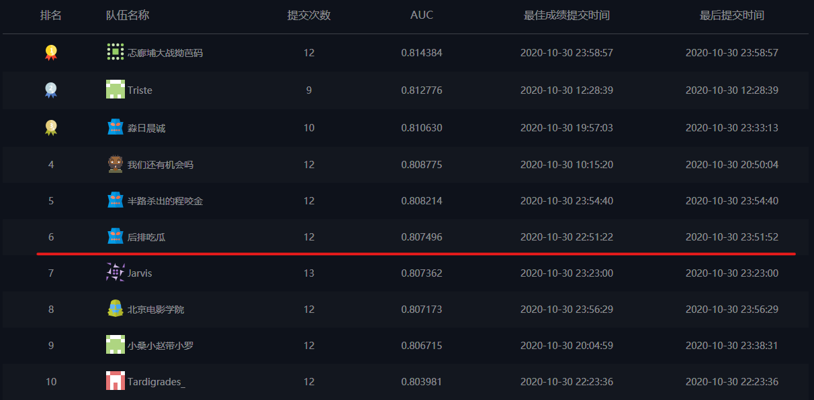

# [DIGIXCTR-2020]('http://developer.huawei.com/consumer/en/activity/devStarAI/algo/')



广告CTR预估是计算广告领域的核心问题，提升广告CTR预估的准确率是提升精准营销效果的核心技术点。在本次大赛中，主办方提供匿名化的海量广告投放数据，参赛选手基于给定的数据构建广告CTR预估模型。希望通过本次大赛挖掘精准营销算法领域的人才，推动广告CTR预估算法的发展。

# 1. 赛题说明

广告CTR预估是计算广告领域的核心问题，提升广告CTR预估的准确率是提升精准营销效果的核心技术点。在本次大赛中，主办方提供匿名化的海量广告投放数据，参赛选手基于给定的数据构建广告CTR预估模型。希望通过本次大赛挖掘精准营销算法领域的人才，推动广告CTR预估算法的发展广告CTR预估是计算广告领域的核心问题，提升广告CTR预估的准确率是提升精准营销效果的核心技术点。在本次大赛中，主办方提供匿名化的海量广告投放数据，参赛选手基于给定的数据构建广告CTR预估模型。希望通过本次大赛挖掘精准营销算法领域的人才，推动广告CTR预估算法的发展。

基础数据集包含两部分：训练集和测试集。其中训练集给定了用户是否点击了某个广告任务的标签，其中1代表点击，0代表未点击；测试集用于计算参赛选手模型的AUC指标。参赛选手需要计算出测试集中每个样本被预测为点击的概率。

# 2. 数据概况

比赛数据（脱敏后）抽取的时间范围是某连续7 天的行为数据。数据集包含：训练集数据文件、测试集数据文件。本章节只说明数据格式，字段的详细含义见比赛官网。

# 3. 评分标准
AUC

# 4. 目录结构
```
.
├── data (数据目录)
│   └── download.py (下载数据)
├── src 
│   ├── concat_feat.py (拼接特征)
│   ├── eda.ipynb (探索分析)
│   ├── get_ctr_feat.py (点击率特征)
│   ├── get_nowaday_feat.py (当日特征)
│   ├── get_prevday_feat.py (前一日特征)
│   ├── get_stat_feat.py (统计特征)
│   ├── get_w2v_feat.py (word2vec特征)
│   ├── lgb.py (训练LGB模型)
│   ├── preprocess.py (数据预处理)
│   └── utils.py (工具类/方法)
├── picture
├── run.sh (执行脚本)
└── README.md
```
## 5. 参考资料

* [图灵联邦-视频点击预测大赛-2020](https://www.turingtopia.com/competitionnew/detail/e4880352b6ef4f9f8f28e8f98498dbc4/sketch)

* [一文梳理2017腾讯广告算法大赛决赛方案](https://zhuanlan.zhihu.com/p/95418813)

* [luoda888/huawei-digix-2020-baseline](https://github.com/luoda888/huawei-digix-2020-baseline.git)

* [digix2020_ctr_rank1](https://github.com/digix2020/digix2020_ctr_rank1.git)

